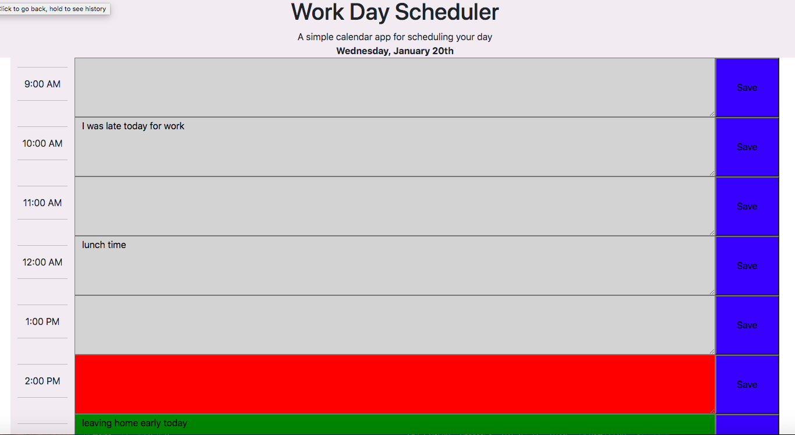

# work_day_scheduler
An application that allows a user to save events for each hour of the day.
This app will run in the browser and feature dynamically updated HTML and CSS powered by jQuery.

# Deployment
Link to the deployed website: https://deepali-gtech.github.io/work_day_scheduler/

Below is screen shorts for the website

### Opening Screen : 
